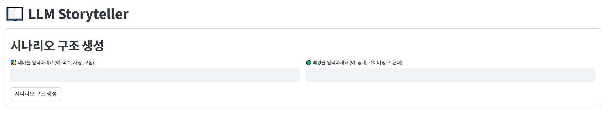
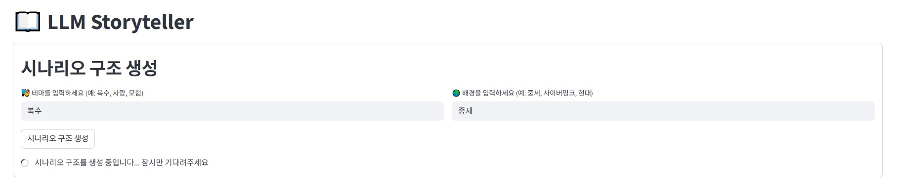
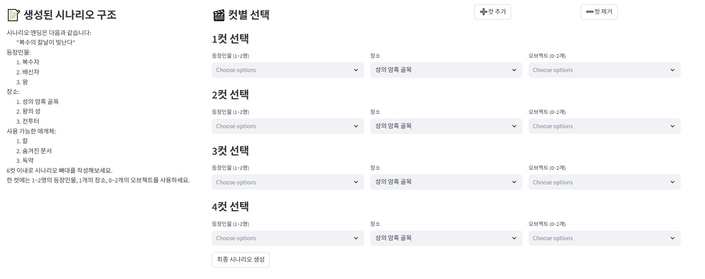
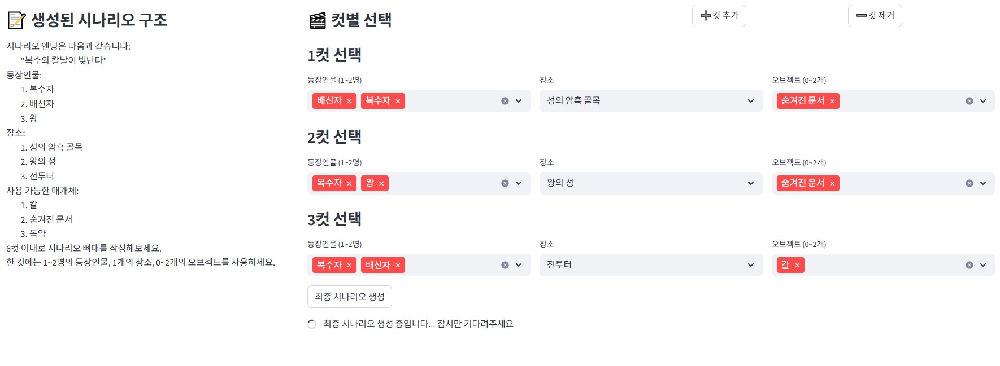
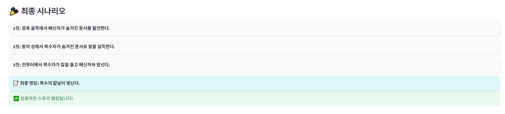

# LLM_GAME - Storyteller

## 개요

본 게임은 스팀 게임 **Storyteller**에서 영감을 받아 제작되었습니다.

플레이어가 시나리오 테마와 배경을 입력하면, LLM이 이를 기반으로 결말과 시나리오에 필요한 등장인물, 장소, 매개체, 최대 컷 수를 생성합니다. 이후 플레이어는 생성된 등장인물, 장소, 매개체를 활용해 컷별 시나리오의 뼈대를 완성합니다.

플레이어는 최대 컷 수 내에서 등장인물, 장소, 매개체를 조합하며 결말에 다가가는 시나리오를 설계하고, LLM은 플레이어의 입력을 창의적으로 해석해 무한 변주 가능한 스토리를 제공합니다.

---

## 프롬프트 엔지니어링
본 프로젝트에서는 두 가지 주요 프롬프트를 사용합니다.

1. 스토리 구조 생성 프롬프트
    - 플레이어가 선택한 테마와 배경을 기반으로 결말, 등장인물, 장소, 매개체, 최대 컷 수를 결정합니다.

<br>

2. 최종 시나리오 생성 프롬프트
    - 1단계에서 생성된 항목과 플레이어가 선택한 컷별 구성을 바탕으로 엔딩과 자연스럽게 연결되는 스토리를 작성합니다.
    - 만약 선택한 컷 구성으로 엔딩 달성이 불가능하면, 새로운 엔딩을 생성하고 재도전을 권유하도록 설계되어 있습니다.

---

## 쥬피터 테스트
### 1단계
``` 1단계
사용자 입력:
    테마: 복수, 배경: 중세

LLM 응답:
    {'ending': '복수의 칼날이 날카롭다',
    'characters': ['복수자', '배신자', '왕'],
    'settings': ['성의 지하 감옥', '왕의 방', '전쟁터'],
    'objects': ['검', '배신의 편지', '방패'],
    'max_cuts': 6}
```
### 2단계
``` 2단계
사용자 선택:
    [{'characters': ['복수자', '배신자'], 'settings': ['전쟁터'], 'objects': ['배신의 편지']},
    {'characters': ['배신자', '왕'], 'settings': ['성의 지하 감옥'], 'objects': ['배신의 편지']},
    {'characters': ['복수자', '배신자'],
    'settings': ['전쟁터'],
    'objects': ['검', '배신의 편지']}]
```
### 최종 시나리오
``` 최종 시나리오
시나리오 최종 결과입니다.
1컷: 전투장에서 배신자의 편지가 드러난다.
2컷: 왕의 방에서 복수자는 왕에게 진실을 전한다.
3컷: 성의 지하 감옥에서 복수자가 배신자와 맞선다.
결말: 복수의 칼날이 날카롭다
성공적인 스토리 텔링입니다!
```

# Streamlit 구현
## 시작 화면


## 시나리오 구조 생성


## 시나리오 구조


## 최종 시나리오 생성


## 최종 시나리오 및 평가
